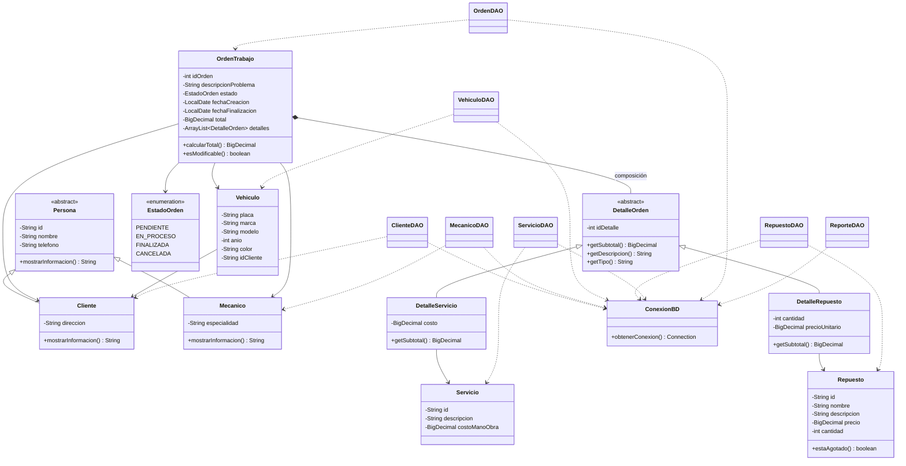
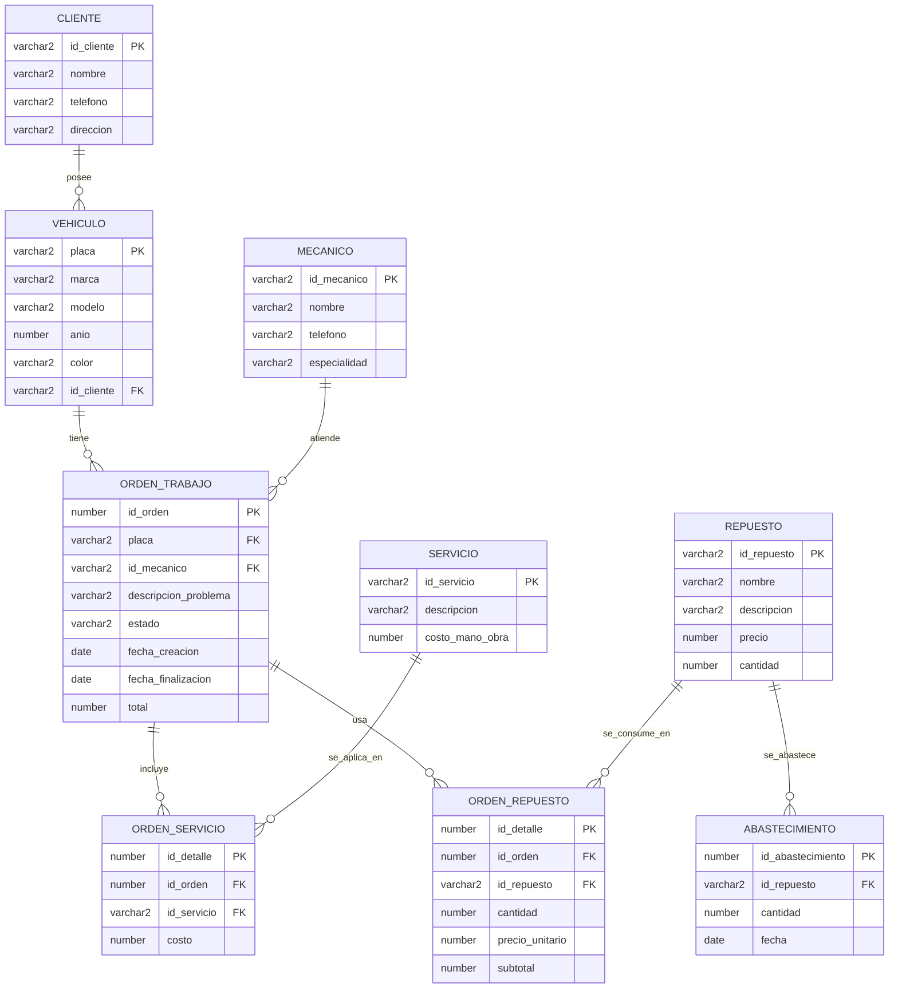

# Diagramas del sistema

## Diagrama de clases (UML)

```mermaid
classDiagram
    class Persona {
        <<abstract>>
        -String id
        -String nombre
        -String telefono
        +mostrarInformacion() String
    }
    class Cliente {
        -String direccion
        +mostrarInformacion() String
    }
    class Mecanico {
        -String especialidad
        +mostrarInformacion() String
    }
    class Vehiculo {
        -String placa
        -String marca
        -String modelo
        -int anio
        -String color
        -String idCliente
    }
    class Repuesto {
        -String id
        -String nombre
        -String descripcion
        -BigDecimal precio
        -int cantidad
        +estaAgotado() boolean
    }
    class Servicio {
        -String id
        -String descripcion
        -BigDecimal costoManoObra
    }
    class EstadoOrden {
        <<enumeration>>
        PENDIENTE
        EN_PROCESO
        FINALIZADA
        CANCELADA
    }
    class DetalleOrden {
        <<abstract>>
        -int idDetalle
        +getSubtotal() BigDecimal
        +getDescripcion() String
        +getTipo() String
    }
    class DetalleServicio {
        -BigDecimal costo
        +getSubtotal() BigDecimal
    }
    class DetalleRepuesto {
        -int cantidad
        -BigDecimal precioUnitario
        +getSubtotal() BigDecimal
    }
    class OrdenTrabajo {
        -int idOrden
        -String descripcionProblema
        -EstadoOrden estado
        -LocalDate fechaCreacion
        -LocalDate fechaFinalizacion
        -BigDecimal total
        -ArrayList~DetalleOrden~ detalles
        +calcularTotal() BigDecimal
        +esModificable() boolean
    }
    class ConexionBD {
        +obtenerConexion() Connection
    }
    class ClienteDAO
    class MecanicoDAO
    class VehiculoDAO
    class RepuestoDAO
    class ServicioDAO
    class OrdenDAO
    class ReporteDAO

    Persona <|-- Cliente
    Persona <|-- Mecanico
    DetalleOrden <|-- DetalleServicio
    DetalleOrden <|-- DetalleRepuesto
    OrdenTrabajo *-- DetalleOrden : composición
    OrdenTrabajo --> Vehiculo
    OrdenTrabajo --> Mecanico
    OrdenTrabajo --> Cliente
    OrdenTrabajo --> EstadoOrden
    Vehiculo --> Cliente
    DetalleServicio --> Servicio
    DetalleRepuesto --> Repuesto

    ClienteDAO ..> ConexionBD
    MecanicoDAO ..> ConexionBD
    VehiculoDAO ..> ConexionBD
    RepuestoDAO ..> ConexionBD
    ServicioDAO ..> ConexionBD
    OrdenDAO ..> ConexionBD
    ReporteDAO ..> ConexionBD
    ClienteDAO ..> Cliente
    MecanicoDAO ..> Mecanico
    VehiculoDAO ..> Vehiculo
    RepuestoDAO ..> Repuesto
    ServicioDAO ..> Servicio
    OrdenDAO ..> OrdenTrabajo
```

## Diagrama entidad-relación

```mermaid
erDiagram
    CLIENTE ||--o{ VEHICULO : posee
    VEHICULO ||--o{ ORDEN_TRABAJO : tiene
    MECANICO ||--o{ ORDEN_TRABAJO : atiende
    ORDEN_TRABAJO ||--o{ ORDEN_SERVICIO : incluye
    SERVICIO ||--o{ ORDEN_SERVICIO : se_aplica_en
    ORDEN_TRABAJO ||--o{ ORDEN_REPUESTO : usa
    REPUESTO ||--o{ ORDEN_REPUESTO : se_consume_en
    REPUESTO ||--o{ ABASTECIMIENTO : se_abastece

    CLIENTE {
        varchar2 id_cliente PK
        varchar2 nombre
        varchar2 telefono
        varchar2 direccion
    }
    MECANICO {
        varchar2 id_mecanico PK
        varchar2 nombre
        varchar2 telefono
        varchar2 especialidad
    }
    VEHICULO {
        varchar2 placa PK
        varchar2 marca
        varchar2 modelo
        number anio
        varchar2 color
        varchar2 id_cliente FK
    }
    REPUESTO {
        varchar2 id_repuesto PK
        varchar2 nombre
        varchar2 descripcion
        number precio
        number cantidad
    }
    ABASTECIMIENTO {
        number id_abastecimiento PK
        varchar2 id_repuesto FK
        number cantidad
        date fecha
    }
    SERVICIO {
        varchar2 id_servicio PK
        varchar2 descripcion
        number costo_mano_obra
    }
    ORDEN_TRABAJO {
        number id_orden PK
        varchar2 placa FK
        varchar2 id_mecanico FK
        varchar2 descripcion_problema
        varchar2 estado
        date fecha_creacion
        date fecha_finalizacion
        number total
    }
    ORDEN_SERVICIO {
        number id_detalle PK
        number id_orden FK
        varchar2 id_servicio FK
        number costo
    }
    ORDEN_REPUESTO {
        number id_detalle PK
        number id_orden FK
        varchar2 id_repuesto FK
        number cantidad
        number precio_unitario
        number subtotal
    }
```
